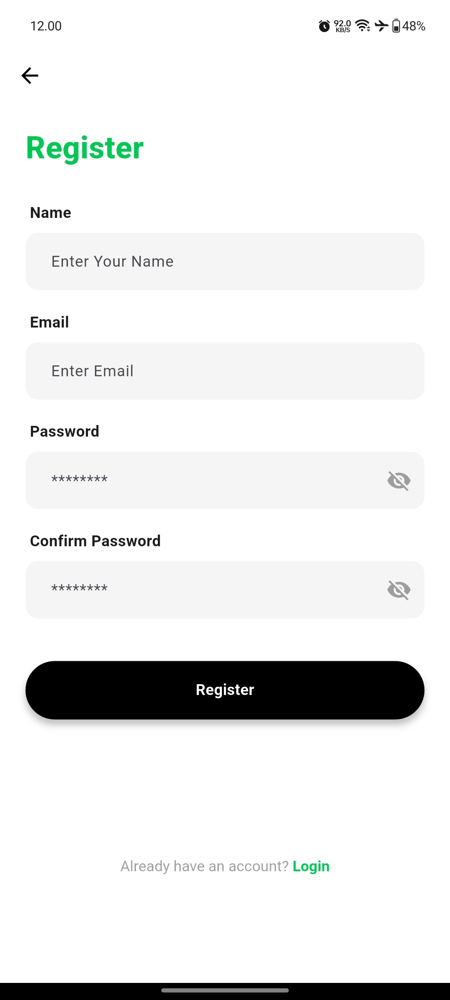
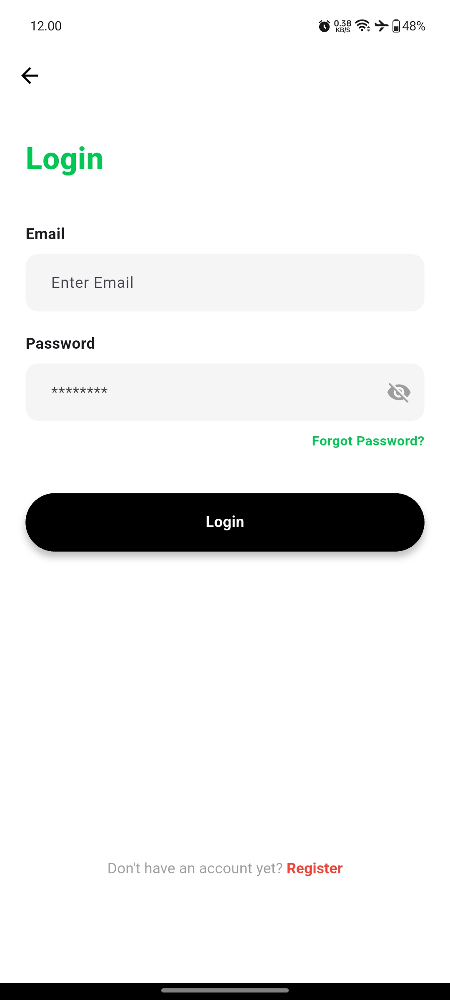
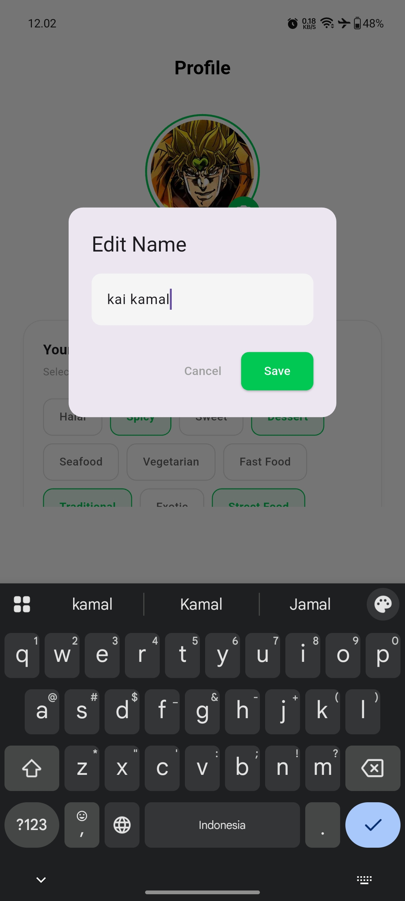

# MeetYourFoods
Project Tugas Besar Ujian Akhir Semester Pemrograman Mobile 2 - RP 23 CID B

## _Swipe, Match & Eat!!_

Developed By Team - Kelompok 3

* Chalik Ruben (23552011333)
* Elis Hilmal Muhibah Syawalah (23552011313)
* Helmi Ahmad Fauzan (23552011433)
* Hilmy Muhamad Dzakwan (23552011368)
* Muhammad Fahmi Abdul Majiid (23552011423)

## Screenshot & Demo Video

## 🎨 Desain Awal (Figma)
[Desain/Mockup Figma](https://www.figma.com/design/6I2xZC9Cd1dLg16NFsw8kF/MeetYourFoods?node-id=1-2&p=f&t=7xNMnfpYPZkFimTV-0)

---

## Alur Autentikasi

<table align="center">
  <tr>
    <td align="center"><b>Splash Screen</b></td>
    <td align="center"><b>Get Started</b></td>
    <td align="center"><b>Register</b></td>
    <td align="center"><b>Login</b></td>
    <td align="center"><b>Forgot Password</b></td>
  </tr>
  <tr>
    <td></td>
    <td></td>
    <td></td>
    <td></td>
    <td></td>
  </tr>
</table>

---

## Halaman Utama & Manajemen Food

<table align="center">
  <tr>
    <td align="center"><b>Home</b></td>
    <td align="center"><b>My Uploads</b></td>
    <td align="center"><b>Add Food</b></td>
  </tr>
  <tr>
    <td></td>
    <td></td>
    <td></td>
  </tr>
</table>

<table align="center">
  <tr>
    <td align="center"><b>Edit Food</b></td>
    <td align="center"><b>Update Success</b></td>
    <td align="center"><b>Delete Food</b></td>
  </tr>
  <tr>
    <td></td>
    <td></td>
    <td></td>
  </tr>
</table>

---

## Maps & Location

<table align="center">
  <tr>
    <td align="center"><b>Go To Maps</b></td>
    <td align="center"><b>Maps</b></td>
  </tr>
  <tr>
    <td></td>
    <td></td>
  </tr>
</table>

---

## Match & Search

<table align="center">
  <tr>
    <td align="center"><b>Find Your Match</b></td>
    <td align="center"><b>Matches</b></td>
    <td align="center"><b>Search</b></td>
  </tr>
  <tr>
    <td></td>
    <td></td>
    <td></td>
  </tr>
</table>

---

## Profile & Informasi

<table align="center">
  <tr>
    <td align="center"><b>Profile</b></td>
    <td align="center"><b>Edit Profile</b></td>
    <td align="center"><b>About</b></td>
  </tr>
  <tr>
    <td></td>
    <td></td>
    <td></td>
  </tr>
</table>

---

## Logout

<table align="center">
  <tr>
    <td align="center"><b>Logout</b></td>
  </tr>
  <tr>
    <td></td>
  </tr>
</table>

---

## 🎥 Demo Video

  <video width="360" controls>
    <source src="./screenshoots/Demo_Aplikasi.mp4" type="video/mp4">
  </video>

